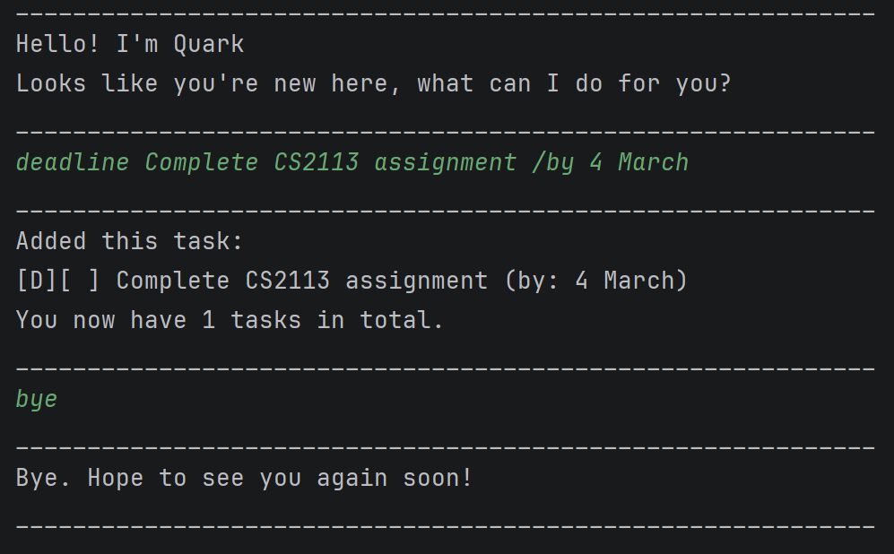

# Quark User Guide



Quark is a Command Line Interface (CLI) application that facilitates the convenient tracking and management of tasks.

## Quick start
1. Ensure you have Java `17` installed in your Computer.

2. Download the latest `.jar` file from [here](https://github.com/HX2003/ip/releases).

3. Open a command terminal, `cd` into the folder you put the jar file in, and use the `java -jar Quark.jar` command to run the application.

4. Proceed to execute commands, refer to the Features below for details of each command.

## Features

### Add a todo task `todo`
Adds a todo task which is the most basic type of task, consisting only of a description and a completion status.

Format: `todo DESCRIPTION`

Example:
* `todo Eat dinner`

### Add a deadline task `deadline`
Adds a deadline task with end date constraints, as well as a description and completion status.

Format: `deadline DESCRIPTION /by ENDDATE`​

Example:
* `deadline Complete CS2113 assignment /by 4 March`

### Add an event task `event`
Adds an event task with start and end date constraints, as well as a description and completion status.

Format: `event DESCRIPTION /from STARTDATE /to ENDDATE`

Example:
* `event CS2113 exam /from 5 May 4pm /to 5 May 5pm`
  
### List all tasks `list`
Lists all tasks.

Format: `list`

Example:
* `list` Returns
```
____________________________________________________________
Here are the tasks:
1. [T][ ] Eat dinner
2. [D][ ] Complete CS2113 assignment (by: 4 March)
3. [E][ ] CS2113 exam (from: 5 May 4pm, to: 5 May 5pm)
____________________________________________________________
```

### Find task by description `find`
Finds tasks whose description contain the given description.

Format: `find DESCRIPTION`

* The filtering is case-insensitive. e.g `alice tan` will match `ALICE TAN`.
* The filtering supports search terms with spaces e.g. `ice ta` will match `ALICE TAN`.

Example:
* `find cs2113 assignment` Returns
```
____________________________________________________________
Here are the matching tasks:
[D][ ] Complete CS2113 assignment (by: 4 March)
____________________________________________________________
```

### Mark task as completed `mark`
Set the specified task as completed.

Format: `mark INDEX`

* Set the task with the specified INDEX as completed.
* The index refers to the index number displayed using the `list` command, which must be a positive integer 1, 2, 3, …​

Example:
* `mark 1` Marks the first task in the list as completed.

### Set task as not completed `unmark`
Set the specified task as not completed.

Format: `unmark INDEX`

* Set the task with the specified INDEX as not completed.
* The index refers to the index number displayed using the `list` command, which must be a positive integer 1, 2, 3, …​

Example:
* `unmark 1` Marks the first task in the list as uncompleted.

### Remove task `delete`
Removes the specified task.

Format: `delete INDEX`

* Deletes the task with the specified INDEX.
* The index refers to the index number displayed using the `list` command, which must be a positive integer 1, 2, 3, …​

Example:
* `delete 1` Removes the first task in the list.

### Remove save file from disk `annihilate`
Removes the save file used to store your tasks from disk.

Format: `annihilate`

### Exiting the application `bye`
Exits the application.

Format: `bye`
